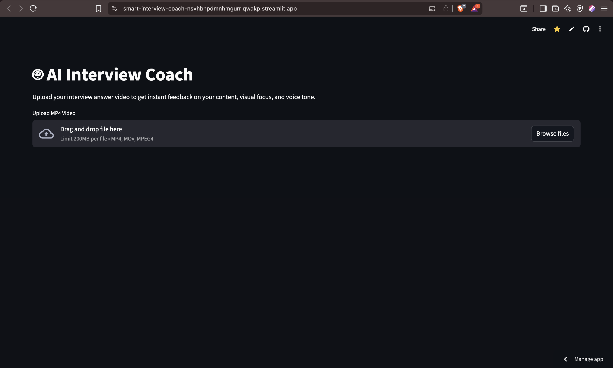

<div align="center">

# 🤖 AI Smart Interview Coach
### Multi-Modal Biometric & Content Analysis System


**An AI-powered coaching system that analyzes *what* you say, *how* you say it, and *where* you look.**

[View Live Demo](https://smart-interview-coach.streamlit.app/) · [Report Bug](https://github.com/Devarshp0511/smart-interview-coach/issues)

</div>

---

## 🚀 Overview

The **Smart Interview Coach** is an end-to-end evaluation platform designed to simulate high-stakes technical interviews. Unlike standard text-based tools, this system employs a **multi-modal approach**:

1.  **Computer Vision Pipeline:** Tracks iris vectors in real-time to quantify eye contact confidence.
2.  **Audio Signal Processing:** Analyzes pitch variance (Librosa) to detect monotone delivery.
3.  **Generative Reasoning:** Uses **Llama-3 (via Groq LPUs)** to provide "Hiring Manager" feedback based on transcript context.



## 🏗️ System Architecture

```mermaid
graph TD
    A[User Video Input] --> B(Orchestrator)
    B -->|Visual Stream| C[Computer Vision Pipeline]
    B -->|Audio Stream| D[Audio Processing Pipeline]
    
    subgraph "Vision Stack"
    C --> C1[MediaPipe Face Mesh]
    C1 --> C2[Iris Landmark Extraction]
    C2 --> C3[Euclidean Vector Calculation]
    C3 --> C4[Gaze Ratio Score]
    end
    
    subgraph "Audio Stack"
    D --> D1[FFmpeg Extraction]
    D1 --> D2[Faster-Whisper ASR]
    D1 --> D3[Librosa Pitch Tracking]
    D3 --> D4[Tone Analysis Dynamic/Monotone]
    end
    
    D2 --> E[LLM Reasoning Engine]
    C4 --> E
    E -->|Context + Metrics| F[Llama-3.1 on Groq]
    F --> G[Final Feedback Report]


🛠️ Key Technical Features👁️

 Biometric Gaze TrackingInstead of generic face detection, I implemented a custom Gaze Estimation Algorithm:Vector Geometry: Calculates the Euclidean distance between the Iris center (Landmark 468) and Eye Corners (Landmarks 33/133).Normalization: Uses the total eye width as a reference to ensure accuracy regardless of camera distance.Performance: Optimized using opencv-python-headless for cloud deployment on Linux environments.⚡ Low-Latency InferenceASR: Integrated faster-whisper (CTranslate2 backend) for 4x faster transcription than standard OpenAI Whisper.LLM: Leveraged Groq's LPU (Language Processing Unit) hardware to generate comprehensive feedback in <2 seconds.📦 Tech StackDomainTools UsedFrontendStreamlit, HTML/CSS InjectionComputer VisionOpenCV, MediaPipe, NumPyAudio AILibrosa (Signal Processing), Faster-Whisper (ASR)Generative AILlama-3.1-8b-Instant (via Groq API)DeploymentStreamlit Cloud (Headless Linux Environment)💻 Installation & Local RunClone the repositoryBashgit clone [https://github.com/Devarshp0511/smart-interview-coach.git](https://github.com/Devarshp0511/smart-interview-coach.git)
cd smart-interview-coach

Install DependenciesBashpip install -r requirements.txt

Run the ApplicationBashstreamlit run app.py

<div align="center"><sub>Built with ❤️ by Devarsh Patel</sub></div>